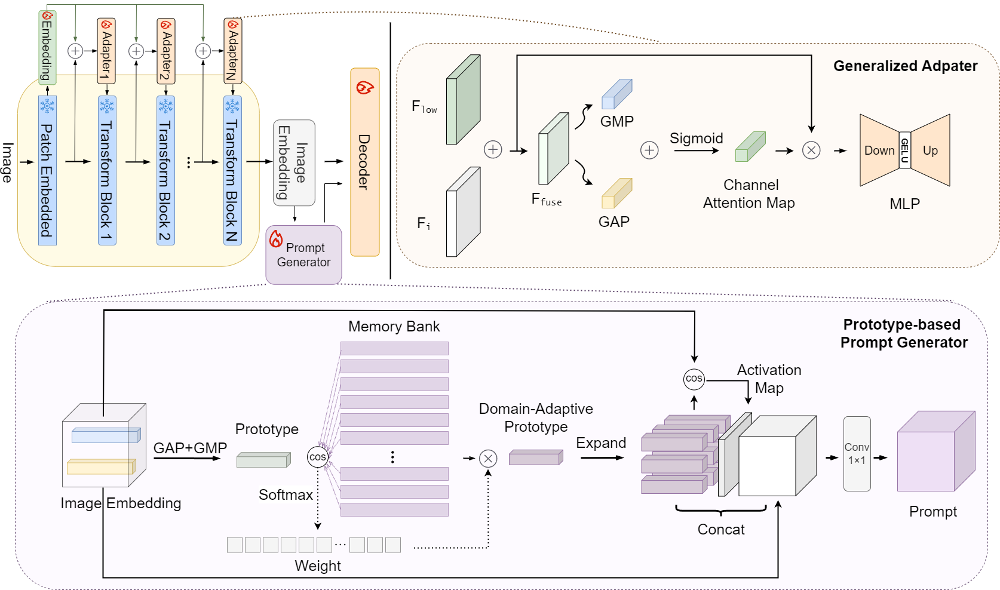

# Prompting Segment Anything Model with Domain-Adaptive Prototype for Generalizable Medical Image Segmentation (DAPSAM)

This is the official code of our MICCAI 2024 paper [DAPSAM](https://baidu.com) 🥳

<div align=center>
	
</div>

## Requirement
``pip install -r requirements.txt``


## Data Preparation
[Prostate Segmentation](https://liuquande.github.io/SAML/)

[RIGA+ Segmentation](https://zenodo.org/records/6325549)

Please download the pretrained [SAM model](https://drive.google.com/file/d/1_oCdoEEu3mNhRfFxeWyRerOKt8OEUvcg/view?usp=share_link) 
(provided by the original repository of SAM) and put it in the ./pretrained folder. 

What's more, we also provide the [DAPSAM-PROSATE-RUNMC](https://drive.google.com/file/d/1rQM2md-h66RlRF3wC0m9N8aheOCvKfYv/view?usp=share_link),
and the [DAPSAM-FUNDUS-BinRushed](https://drive.google.com/file/d/1rQM2md-h66RlRF3wC0m9N8aheOCvKfYv/view?usp=share_link). Please put it in the ./snapshot folder for evaluation. 


## Prostate Segmentation

We take the setting using RUNMC (source domain) and other five datasets (target domains) as the example.

```
cd prostate
# Training
CUDA_VISIBLE_DEVICES=0 python train.py 
# Test
CUDA_VISIBLE_DEVICES=0 python main.py 
```


## RIGA+ Segmentation

We take the setting using BinRushed (source domain) and other three datasets (target domains) as the example.

```
cd fundus
# Training
CUDA_VISIBLE_DEVICES=0 python train.py 
# Test
CUDA_VISIBLE_DEVICES=0 python main.py 
```


## Cite 
If you find this code useful, please cite
~~~

~~~

## Acknowledgement

We appreciate the developers of [Segment Anything Model](https://github.com/facebookresearch/segment-anything). 
The code of DAPSAM is built upon [SAMed](https://github.com/hitachinsk/SAMed), and we express our gratitude to these awesome projects.